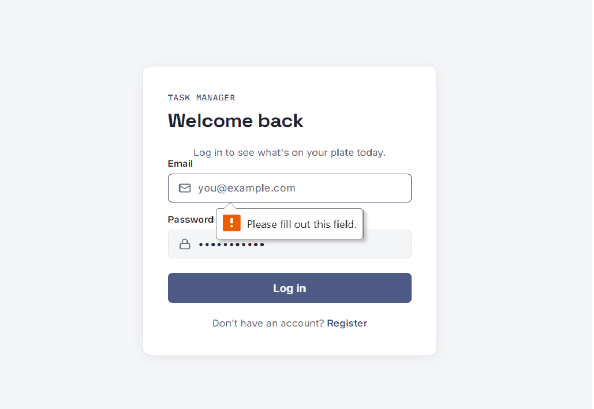
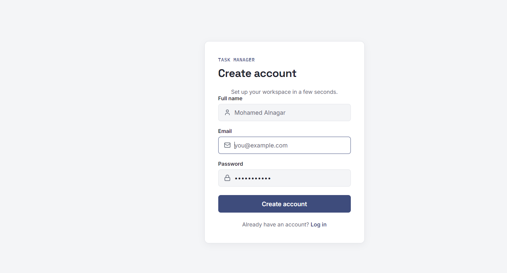
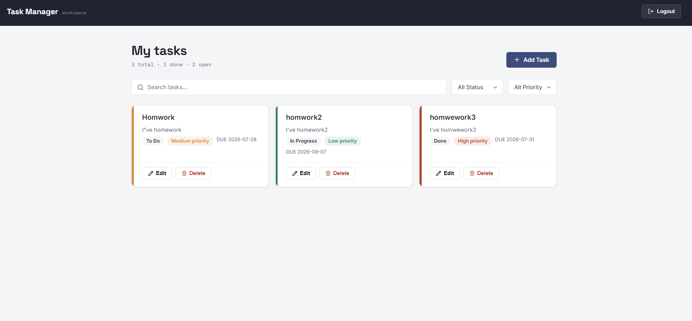
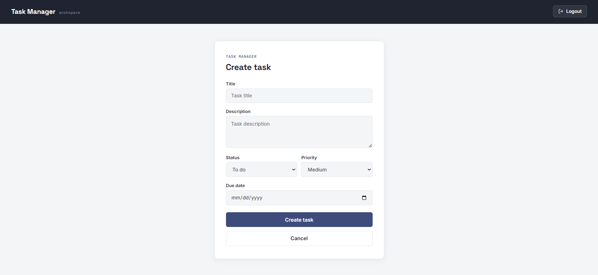

# Task Manager - MERN Stack 🚀

A full-stack task management application built using the MERN stack.  
The application allows users to create, manage, update, and organize their tasks with authentication, filtering, and a modern responsive UI.

---

## 📌 Features

### Task Management

- Create new tasks
- View all user tasks
- Update existing tasks
- Delete tasks
- Task status management
- Task priority management
- Due date tracking


### Search & Filtering

- Search tasks by title

- Filter by status:
  - To Do
  - In Progress
  - Done

- Filter by priority:
  - Low
  - Medium
  - High


### User Experience

- Responsive dashboard
- Modern authentication UI
- Task cards with priority indicators
- Read more / Read Less for long descriptions
- Loading states
- Error handling
- Confirmation before deleting tasks


---

## 🔐 Authentication Flow

1. User registers an account.
2. User logs in using email and password.
3. Backend validates credentials.
4. Backend generates JWT token.
5. Token is stored on the client side.
6. Protected routes require JWT authentication.
7. Backend verifies token before allowing access.


---

# 🛠 Tech Stack

## Frontend

- React.js
- React Router DOM
- Axios
- Lucide React Icons
- CSS3
- Vite


## Backend

- Node.js
- Express.js
- MongoDB
- Mongoose
- JWT Authentication
- Express Validator


## Database

MongoDB stores:

- Users
- Tasks


## Tools

- Git & GitHub
- Postman
- MongoDB Compass


---

# 📂 Project Structure

```text
task-manager

├── backend
│
│   ├── src
│   ├── controllers
│   ├── models
│   ├── routes
│   ├── middleware
│   ├── validators
│   └── server.js
│
├── frontend
│
│   ├── src
│   ├── api
│   ├── components
│   ├── context
│   ├── hooks
│   ├── pages
│   ├── routes
│   └── styles
│
└── README.md

---
```


## ⚙️ Installation & Setup

Follow these steps to run the project locally.

## Prerequisites

Make sure you have the following installed:

- Node.js (v18 or higher)
- React js
- npm
- MongoDB
- Git


Check installed versions:

```bash
node -v
npm -v
mongod --version
```
## Environment Variables

Create a `.env` file inside the backend folder:

```env
PORT= 

MONGO_URI=mongodb:url

JWT_SECRET=your_jwt_secret_key

JWT_EXPIRE=7d
```
## 🎮 Demo Account

You can use the following account to test the application:
test email : test@gmail.com 
password : 123456

# 📸 Screenshots

## Login Page



---

## Register Page



---


## Dashboard Page



---

## Form Task

